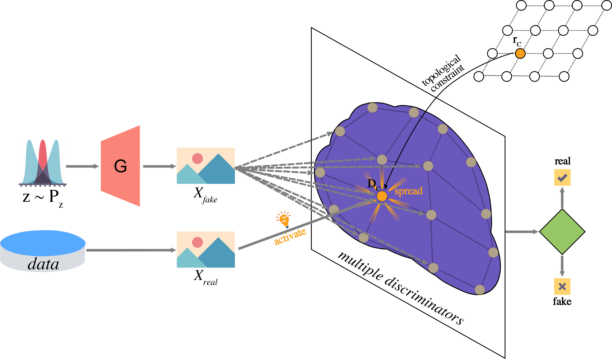

# SOMGAN -- Official PyTorch implementation

"Improving Mode Exploring Capability of Generative Adversarial Nets by Self-Organizing Map"

In this paper, we propose a new approach to train the GANs with one generator and a mixture of discriminators to overcome the mode collapse problem. 
In our model, each discriminator not only distinguishes real and fake samples but also differentiates modes in datasets. 
In essence, it combines a classical clustering idea called Self-Organizing Map and multiple discriminators into a unified optimization objective.
Specifically, we define a topological structure over the multiple discriminators in order to diversify the generated samples and to capture multi-modes. 
We term this method Self-Organizing Map Generative Adversarial Nets (SOMGAN).
By utilizing the parameter sharing trick, the proposed model requires trivial extra computation compared with GANs with a single discriminator. 
In our experiment, the method covers diverse data modes and gives outstanding performance in qualitative and quantitative evaluations. 
Since the topological constraint of discriminators is irrelevant to the generator, the SOM-based framework can be embedded into arbitrary GAN frameworks to maximize the generative capacity of the target model.

## datasets

## metrics

## training records
